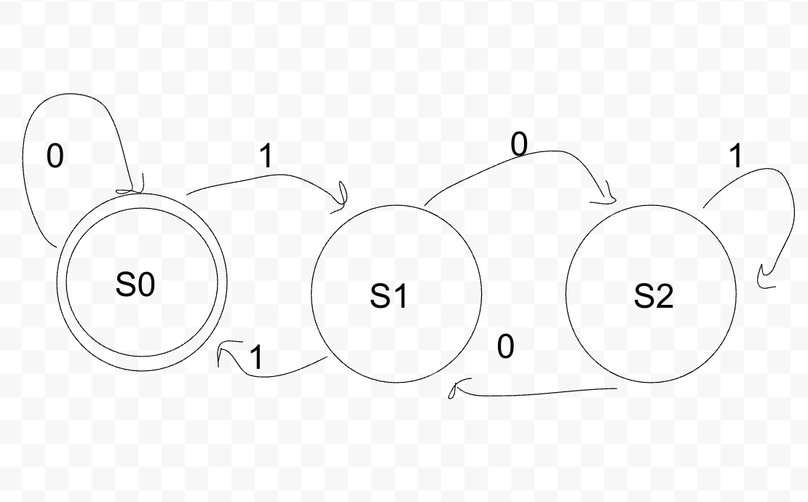
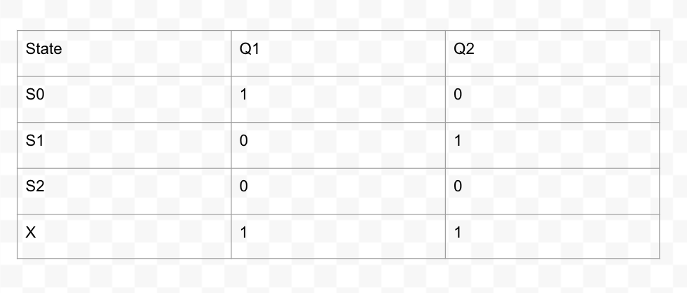
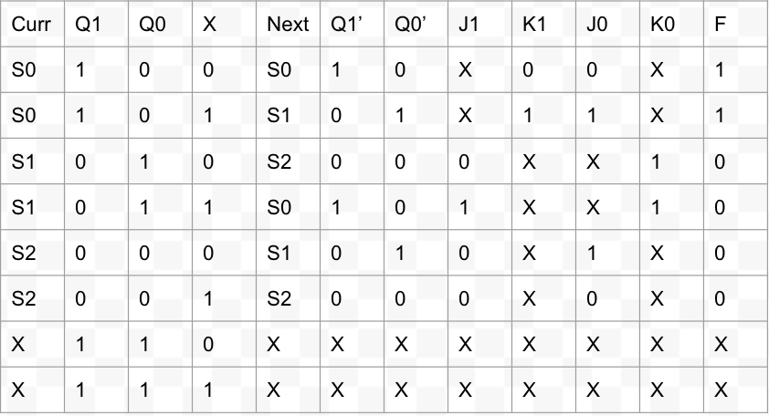
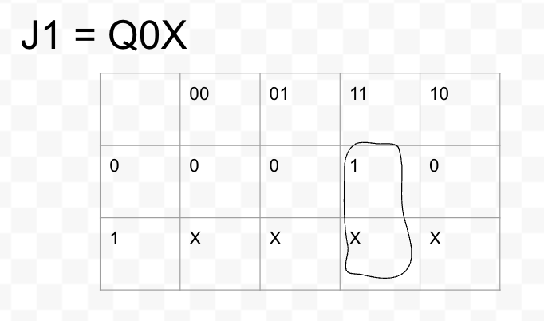
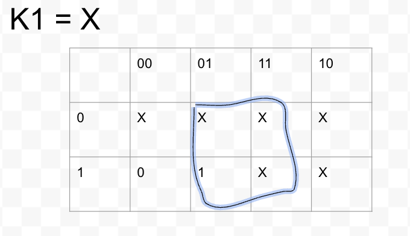
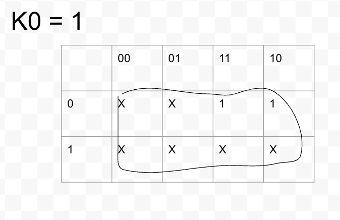
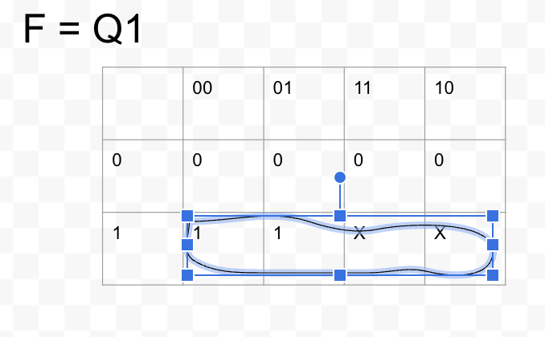
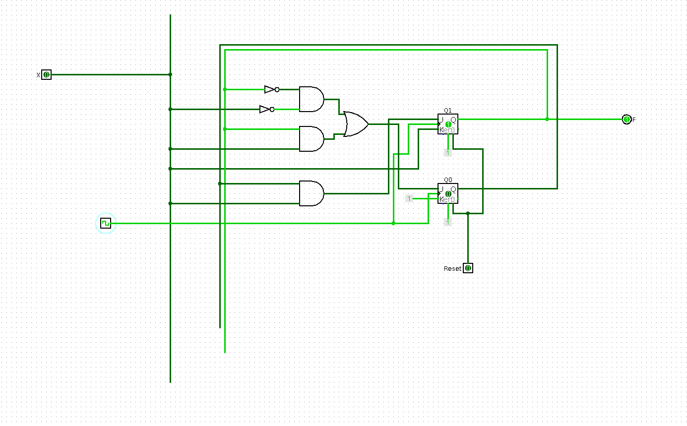

# Lab X: Doing stuff with hardware!

Please write a blog post describing your lab here.

This is just an example of how you might structure your blog post, feel free to edit as you wish. For example, you might divide the lab into different sections each with their own intro, instructions, results, and takeaways. Please see the rubric for details on how the post will be evaluated.

## Overview and Motivation
This week we'll explore...

## Materials
-IC data sheets

-PB-503 breadboard prototyping station

-Wires and connection tools

-Logic Probes

-Logic Switches

-Push Button

-7404 NOT gate IC

-7408 AND gate IC

-7486 XOR gate IC

-7476 JK Flip Flop IC

-Resistors

## Project Steps
In order to start designing the circuit, we first needed to design a FSM (DFA-Deterministic Finite Automata), using a state transition diagram. We designed it in the way that if the stream x, ends in 00, then the circuit outputs and 1, and if it ends in anything else, in outputs a 0.

Next we had to contruct a state table. A state table shows us the states and the steps taken inorder to reach those states. If you look at the image below you will see that our starting state is S0. This is because we want our stream to end in 00.

-Below is our state table.

After we created a state table we need to the FSM to and state table to create a function table. This shows us the before and after values for signals in the circuit. It showa the signals that are sent to the J and K inputs. 

- Below is the state table.

Next, after creating the function table we use the values from the table inorder to contruct k-maps to create our circuit.

Finally, we use the k-maps to design and build the circuit.

-Below is the logisim design of our circuit.

-Below is the final circuit we built on the breadboard.

## Testing
In the testing phase of our lab, we aimed to rigorously evaluate our circuit's ability to determine if a binary number is divisible by three, a challenge that required careful planning and execution. Our testing methodology was designed to encompass a comprehensive range of scenarios, ensuring the circuit's reliability and accuracy across various inputs.

For example, we started with inputs like "0" and "1", which correspond to decimal values of 0 and 1, respectively, and observed the outputs. The real test of our circuit's design came with longer sequences, such as "010" and "01001", which translate to the decimal values of 2 and 9, respectively. Each input sequence was carefully chosen to challenge the circuit's ability to accurately transition between states and produce the correct output, whether the cumulative binary number was divisible by three.

In order to test the circuit we had to have the x input certain streams to see if the output of the circuit was correct. If you remeber, the circuit is supposed to out put a 1 if the stream ends in 00, and it's supposed to output a 0 for anything else. We tested multiple inputs of x to ensure that the output was correct.  The testing phase included scenarios that were designed to simulate potential edge cases, such as long sequences of zeros, which could potentially trip up the state transition logic if not correctly accounted for in the design

See the video below for a demostration.

## Conclusion

To conclude, with the lab, we began with a clear objective: to design and construct a circuit capable of detecting whether a binary input stream ends with "00". This venture required not only a robust understanding of digital logic but also the practical skills necessary for realization. Initially, we laid the  foundation by designing a Deterministic Finite Automata (DFA), which provided a structured plan detailing state transitions. This was crucial as it translated our concept into a plan complete with expected behaviors for each state transition.

Following the DFA, we created a state table, acting as both a roadmap and a checklist to ensure the circuit behaved as expected, detailing the specific transitions and outputs for each possible input. The transition from this table to the creation of a function table was pivotal, as it outlined the logic levels for the circuit's inputs and outputs, guiding the actual design. This detailed planning phase highlighted the importance of a solid theoretical foundation, transforming understanding into actionable steps.

With the function table in hand, we developed K-maps for simplification. This step was essential for reducing the circuit's complexity, highlighting the importance of efficiency in design. It allowed us to minimize the components needed, paving the way for a more streamlined and error-resistant construction. The process of bringing these designs to life on a breadboard, where theory met reality, was both challenging and enlightening. We navigated the process of assembling the circuit, learning the importance of practical skills in circuit construction and the value of iterative troubleshooting and refinement.

The primary achievement of this lab was the successful translation of theoretical concepts into a functional digital circuit. Our design accurately identified binary sequences ending in "00", validating our approach through rigorous testing. This experience showed the experience of engineering, where design, testing, and refinement are crucial for success. It provided us with valuable stuff in the importance of planning, the efficiency of design through simplification, and the critical nature of practical skills in realizing theoretical concepts. This learning experience has equipped us with insights that will benefit us going forward.

