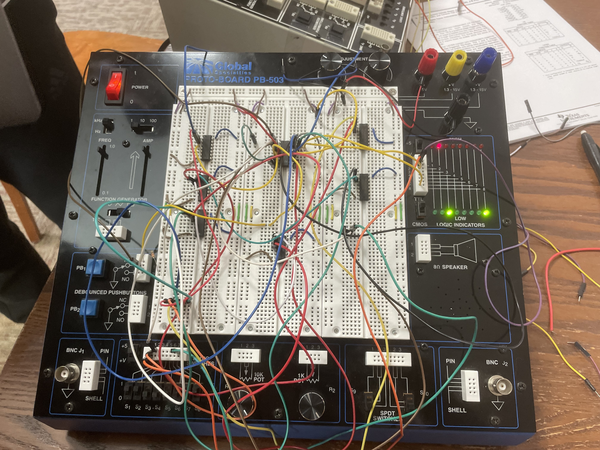

# Lab 05: Finite State Machine Design

## Overview and Motivation

This lab delves into the design of a finite state machine (FSM), specifically tasked with reading binary numbers and determining their divisibility by three. This lab not only strengthens the understanding of sequential logic circuits but also serves as a practical application of digital design principles. This task underscores the significance of FSMs in parsing input streams and showcases the dynamic interaction between state transitions and output responses.

## Lab Objectives

- Design a deterministic finite automaton (DFA) to assess the divisibility of binary inputs by three.
- Manage the states of the DFA using JK flip-flops to track and transition between states.
- Construct two combinational logic circuits for determining the next state and output based on the current state and input bit.
- Create a function table to define the logic relations between the state (Q values), input bits, and the desired output.
- Use K-Maps for each output to optimize the circuit design through logical minimization.
- Build the circuit using Logisim software to validate functionality before physical assembly.
- Assemble and test the physical circuit to ensure it meets design specifications and functional requirements.

## Materials
- IC data sheets

- PB-503 breadboard prototyping station

- Wires and connection tools

- Logic Probes

- Logic Switches

- Push Button

- 7404 NOT gate IC

- 7408 AND gate IC

- 7486 XOR gate IC

- 7476 JK Flip Flop IC

- Resistors

## Project Steps

### 1. Designing a Finite State Machine (FSM)

In order to start designing the circuit, we first needed to design a FSM (DFA-Deterministic Finite Automata), using a state transition diagram. 

- A deterministic finite automaton (DFA) is a model of computation that consists of a limited number of states, transitions between those states, and one start state. It reads a string of symbols (input), and by following the transitions, which are determined by the current state and the input symbol, the DFA can accept or reject the string by ending in an accepting or non-accepting state. 

- We need to create a DFA where the objective is to form binary sequences that can be evenly divided by 3. In binary, we only have two possible inputs: 0 and 1. For our DFA to be deterministic, each state must have a clear directive for what to do when it encounters either a 0 or a 1. Without explicit instructions for both inputs at every state, the system wouldn't be deterministic.

- We designed it in the way that if the stream `x`, ends in 00, then the circuit outputs and 1, and if it ends in anything else, it outputs a 0.

### 2. Creating a State Table

The next step is to build a state table. The two main objectives of the State Table step are:
1. Determine the number of JK flip flops we need. 
2. Create a table and assign states to JK ff values.

-  Each row of the table will represent one state in the FSM. We will use a “binary number” formed by the values of the JK flip flops to represent each state. Each state must have a unique binary number.

- We need two bits in our binary number to represent three different states. Thus we need two JK flip-flops. We will call the flip-flops `Q1` and `Q2` (`Q` is the output of each flip-flop). We now make an assignment of JK ff values to states as shown below.

- If you look at the image below you will see that our starting state is `S0`. This is because we want our stream to end in 00.

### 3. Creating the Function Table

- The purpose of this step is to specify the actual before and after values for the various signals in the circuit, especially the JK ffs.

- We need to capture the detail of what signals to send to each JK ff as the J and K inputs so that the flip-flop output value on the next clock cycle represents the correct next-state value.

- This step involves a huge table where
    - The left side of the table is the current information (current state, current input for x). 
    - The middle section of the table is the next information (next state) and the control inputs for the JK flip-flops that cause this next state to happen correctly. 
    - The rightmost column lists the desired output, F , based on the current state.

- Below is the function table.

In the above function table:

- The `Curr` column lists the current states, labeled `S0`, `S1`, and `S2`, and a placeholder `X` for undefined states.
- The `Q1` and `Q0` columns represent the current outputs of two flip-flops before the input `X` is applied.
- The `X` column shows the current input being either a 0 or a 1.
- The `Next` column indicates the resulting next state the system should transition to given the `Curr` state and `X` input.
- `Q1'` and `Q0'` represent the expected outputs of the flip-flops in the next state.
- The `J1`, `K1`, `J0`, and `K0` columns specify the signals to be sent to the corresponding `J` and `K` inputs of the JK flip-flops to achieve the transition from the current to the next state.
- The `F` column shows the desired output based on the current state.

The table incorporates `'don't care'` conditions (indicated by `X` in the JK inputs), which allows for flexibility in designing the circuit logic because the specific input doesn't affect the outcome in certain cases. These conditions are useful for simplifying the circuit design later on. The function table ensures that every possible current state and input combination is accounted for, leading to a deterministic and correctly functioning circuit.

### 4. Constructing K-Maps

Next, after creating the function table we use the values from the table inorder to contruct K-Maps to build our circuit.

Finally, we use the k-maps to design and build the circuit.

- Below is the logisim design of our circuit.

- Below is the final circuit we built on the breadboard.

## Testing

After assembling the circuit, we moved on to the testing phase, which involved inputting binary numbers through a simple mechanism: toggling the x switch. To add a "1" to the binary number, we flipped the switch to "1"; to add a "0", we flipped it to "0". The circuit updated with each push of the button designated as the clock, adding the new bit to the end of the binary string. We conducted tests using numbers both divisible and not divisible by 3, closely observing the circuit's response, which aligned perfectly with our initial designs and expectations based on the Deterministic Finite Automata.

The testing revealed that the circuit accurately reflected the state of divisibility by 3. When the binary number was not divisible by 3 (not in an accepting state), the probe light remained off. Conversely, when a number divisible by 3 was input (returning to an accepting state), the probe light turned on, indicating the desired outcome. Additionally, we evaluated the circuit's CLEAR function, which allows for resetting the system. By toggling the reset switch off and then on, we successfully cleared the circuit's memory, enabling us to start anew with a different binary number. This level of functionality and control during testing affirmed the circuit's design and operational efficacy.

In order to test the circuit we had to have the x input certain streams to see if the output of the circuit was correct. If you remeber, the circuit is supposed to out put a 1 if the stream ends in 00, and it's supposed to output a 0 for anything else. We tested multiple inputs of x to ensure that the output was correct.  The testing phase included scenarios that were designed to simulate potential edge cases, such as long sequences of zeros, which could potentially trip up the state transition logic if not correctly accounted for in the design

See the video below for a demostration.

## Conclusion

To conclude, with the lab, we began with a clear objective: to design and construct a circuit capable of detecting whether a binary input stream ends with "00". This venture required not only a robust understanding of digital logic but also the practical skills necessary for realization. Initially, we laid the  foundation by designing a Deterministic Finite Automata (DFA), which provided a structured plan detailing state transitions. This was crucial as it translated our concept into a plan complete with expected behaviors for each state transition.

Following the DFA, we created a state table, acting as both a roadmap and a checklist to ensure the circuit behaved as expected, detailing the specific transitions and outputs for each possible input. The transition from this table to the creation of a function table was pivotal, as it outlined the logic levels for the circuit's inputs and outputs, guiding the actual design. This detailed planning phase highlighted the importance of a solid theoretical foundation, transforming understanding into actionable steps.

With the function table in hand, we developed K-maps for simplification. This step was essential for reducing the circuit's complexity, highlighting the importance of efficiency in design. It allowed us to minimize the components needed, paving the way for a more streamlined and error-resistant construction. The process of bringing these designs to life on a breadboard, where theory met reality, was both challenging and enlightening. We navigated the process of assembling the circuit, learning the importance of practical skills in circuit construction and the value of iterative troubleshooting and refinement.

The primary achievement of this lab was the successful translation of theoretical concepts into a functional digital circuit. Our design accurately identified binary sequences ending in "00", validating our approach through rigorous testing. This experience showed the experience of engineering, where design, testing, and refinement are crucial for success. It provided us with valuable stuff in the importance of planning, the efficiency of design through simplification, and the critical nature of practical skills in realizing theoretical concepts. This learning experience has equipped us with insights that will benefit us going forward.

